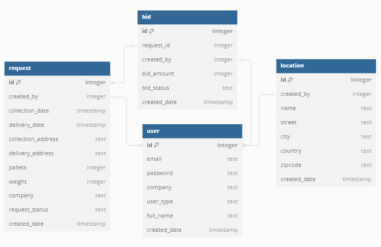

# Move My Pallets - Logistics Website
**Move My Pallets** is a personal project aimed at exploring Flask, a Python web framework, and Jinja2 templating engine. The project involves creating a relational database and implementing routing functions to manage interactions between users acting as Customers or Suppliers.

## Overview
**Move My Pallets** is a web platform designed to streamline the transportation of goods across Europe. It offers two primary user roles:

* **Customers**: Users who need to move goods from one location to another can create transport requests specifying details such as pallet count, weight, and origin/destination.

* **Suppliers**: Users who provide transportation services can view open requests from Customers and submit competitive bids.

## Key Features
* **User Authentication**: Secure sign-up and login functionality for Customers and Suppliers.

* **Request Management**: Customers can create, view, and manage transport requests.

* **Bid Management**: Suppliers can browse open requests and submit bids with pricing and service details.

## Technology Stack

* Python: Flask web framework, Jinja2 templating engine.
* SQLite: Relational database for storing user, location, request, and bid data.
* Bootstrap: Front-end framework for responsive design and UI components.
* HTML/CSS: Basic HTML for website structure and styling.

## Database Schema




## Functionality

* User Authentication: Users can sign up, log in, and manage their profiles.
* Location Management: Customers can add, edit, and delete locations.
* Request Management: Customers can create transport requests with detailed specifications.
* Bid Management: Suppliers can view open requests and submit competitive bids.

## Installation and Usage
For now (29/06/2024), I have the project running here: https://move-my-pallets.onrender.com/

Installation

```Close the repository
git clone https://github.com/davidweatherstone/move_my_pallets.git
cd logistics_flask_project
```

```Create a virtual environment
python -m venv venv --prompt="logistics"
```

```Activate the environment
# Windows
venv\Scripts\activate

# bash
source venv/Scripts/activate
```

```Install dependencies
pip install -r requirements.txt
```

```Initialize the database
flask --app logistics init-db
```

```Run the app
flask --app logistics run --debug
```

Following this, sign up as both a Customer and a Supplier to explore the different functionality that each user has access to. 

## Additional Notes
While SQLite has been useful for building this project, and could work with small-scale applications, I'm aware of its limitations and if I was to take this project further I would consider a more robust database solution such as PostreSEL and MySQL.
